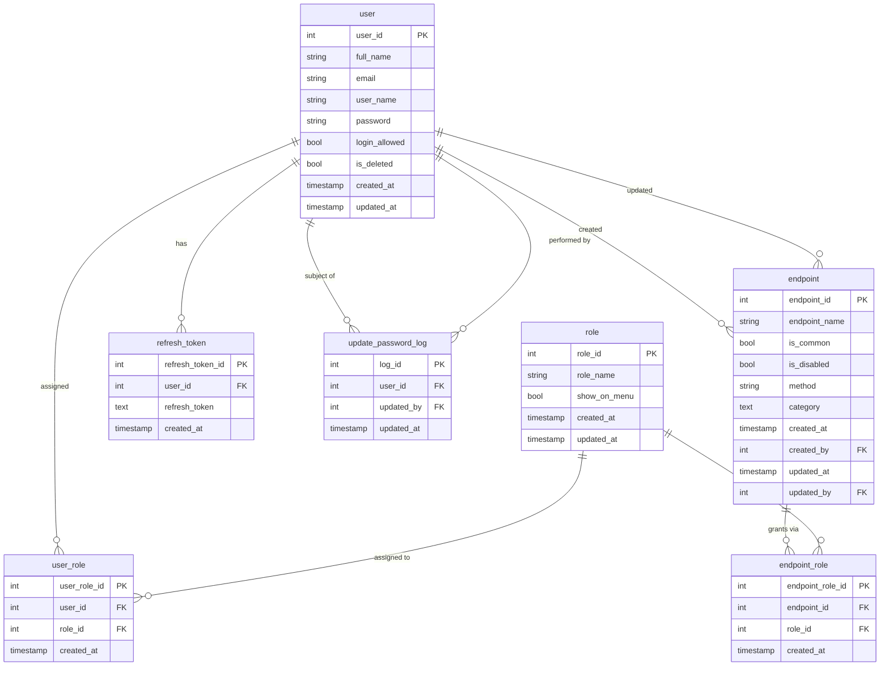
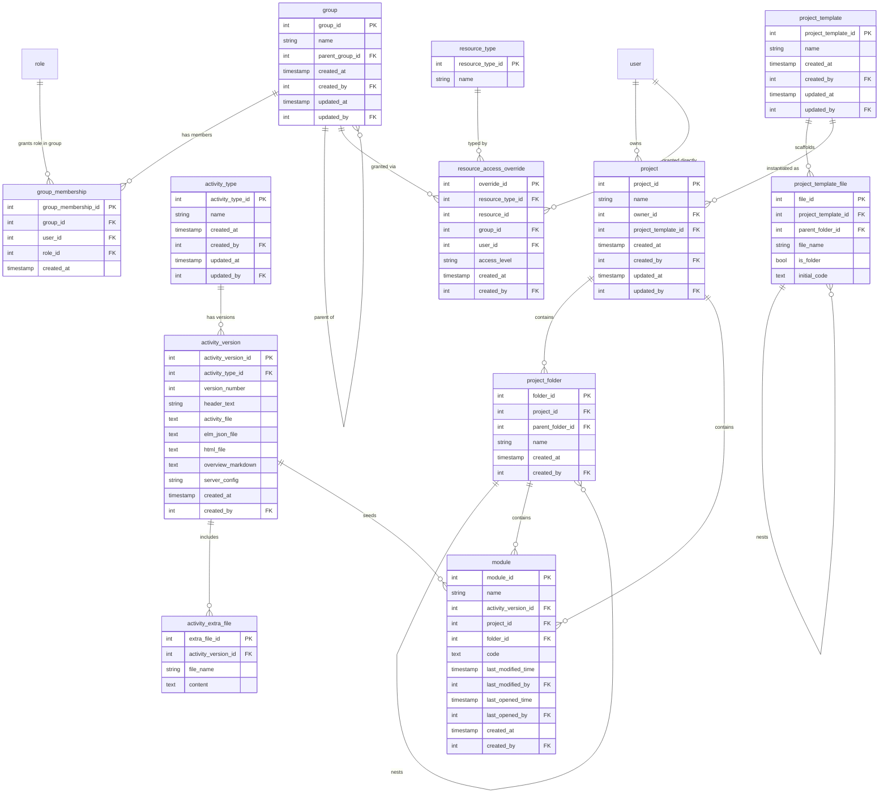

# DB Diagram

Rendered from [DB_SCHEMA.md](DB_SCHEMA.md). GitHub renders mermaid natively; for other viewers use https://mermaid.live or the VSCode "Markdown Preview Mermaid Support" extension.

## Reading it
- `user ↔ role` is many-to-many, joined through `user_role`.
- `endpoint ↔ role` is many-to-many, joined through `endpoint_role`. This is the actual permission check: a user can hit an endpoint if any of their roles appears in that endpoint's `endpoint_role` rows — unless `endpoint.is_common` (open to all) or `endpoint.is_disabled` (blocked for all), both checked before the role lookup.
- `update_password_log` has two FKs to `user` (subject + actor) — drawn as two separate relationships above since mermaid ER diagrams can't label a self-referencing pair on one line.

## Content model (draft)

Table proposal for the `elm-plan` product docs — not implemented in `app/db/` yet. Column detail and design rationale in [DB_SCHEMA.md](DB_SCHEMA.md#content-model-draft--not-yet-implemented).

### Reading it
- `group ||--o{ group : "parent of"` is the subgroup self-reference (`parent_group_id`) — a group can have child groups.
- `group_membership` is where per-Group role lives (`Admin`/`Member`/`Mentor`/`Not in group`, reusing the auth `role` table) — a user's role is per-Group, there is no flat `user.role` for content permissions.
- `module.activity_version_id` pins a module to the exact activity version it was created from, not just the activity type — new versions never retroactively change existing modules (versioning decision from [Activity Types](../elm-plan/05-activity-types.md)).
- `module.project_id` nullable: null means it's a personal "My Elm Modules" module; set means it lives only inside that project's namespace, never in the creator's personal list.
- `resource_access_override` is intentionally one generic table (`resource_type_id` + `resource_id`, polymorphic) rather than a separate override table per resource — covers activity types, activity versions, project templates, projects, and modules alike. A direct `user_id` grant/deny always wins over anything derived from `group_id`/role.
- `resource_type` is a lookup table, not a hardcoded enum — new overridable resource types are a row insert, no migration.
